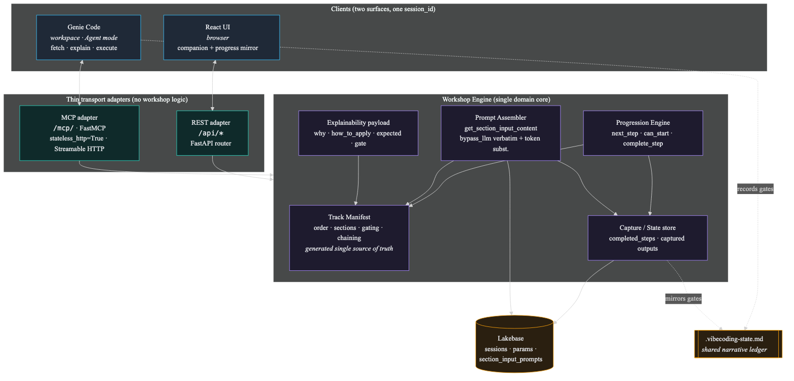

# Workshop-over-MCP — Single Engine, Two Surfaces (roadmap + handoff spec)

**Status:** Proposed · Phase 0 ready to execute · **Author:** pairing session (research → architecture) · **Date:** 2026-09-19
**Target repo:** `vibe-coding-workshop-app` (the deployable Databricks App)
**Depends on:** the Genie Accelerator track already shipped per [`PLAN.md`](./PLAN.md), plus the
refinements in [`genie-accelerator-diagram-and-optional-lakehouse.md`](./genie-accelerator-diagram-and-optional-lakehouse.md),
[`genie-track-activation-and-step-cleanup.md`](./genie-track-activation-and-step-cleanup.md), and
[`genie-accelerator-prompt-standardization.md`](./genie-accelerator-prompt-standardization.md).
**Companion artifact:** [`images/mcp-workshop-engine-architecture.png`](./images/mcp-workshop-engine-architecture.png)
(source: [`images/mcp-workshop-engine-architecture.mmd`](./images/mcp-workshop-engine-architecture.mmd)).

---

## 0. Read this first (context for the executing agent)

Today the workshop is a **web UI that emits copy-ready prompts** a learner pastes into their
coding assistant. This spec turns the app into an **MCP server** so **Genie Code** (Databricks'
native coding agent) connects to it directly and **fetches, explains, and executes** the workshop
steps in-conversation — no copy-paste. The first track delivered this way is **Genie Accelerator**;
the architecture is designed so **every track** can follow with no second codebase.

The central design decision: **lift orchestration out of the frontend into a backend Workshop
Engine that both the UI and MCP consume.** Prompt *content* is already backend-owned; track
*ordering / gating / chaining / next-step* is currently frontend TypeScript. That split is what
would cause divergence, so we close it.

**Golden rules (carried from `PLAN.md`, extended for MCP)**
- The **only** binding between a step and its prompt row is the **`sectionTag`** string. Step
  `number` (in `ALL_STEPS`) and seed `input_id` are **independent namespaces** — do not equate them.
- Every Genie Accelerator seed row is `bypass_llm = true` → `input_template` returns **verbatim**
  with `{token}` substitution; **no FM-API call**. The MCP `get_step` tool returns that same
  verbatim text. So "does the prompt read well" is fully determined by the seed text.
- **One engine, two thin adapters.** Adapters (`/api/*` REST, `/mcp/` MCP) contain **no workshop
  logic** — they translate transport only. All order/gating/chaining/assembly lives in the engine.
- **One prompt path.** Both adapters call the existing `get_section_input_content`
  (`src/backend/api/routes.py:1201`). **Do not** write a second assembler for MCP.
- **One manifest, generated — never hand-copied.** The track manifest is the single source of
  truth for order/gating/chaining. A contract test asserts the UI's rendered order equals the
  engine's order for every track.
- **Stateless MCP.** `mcp.http_app(stateless_http=True)`; per-request reads; all durable state in
  Lakebase keyed by `session_id`. Never rely on in-process caches/rate-buckets for correctness.
- **Do not** run `databricks bundle init`. Reseed only through the app's own scripts.
- **STOP and ask** before deploying to any real workspace. Prompt-content changes require a
  **reseed + redeploy**; engine/adapter code changes require a **code redeploy**.
- Keep lockfile policy and the existing lint baseline intact (no new lint errors).

**Grounding facts already verified against the app repo (2026-09-19)**

| Fact | Value |
|---|---|
| App entry point | `app.py` — FastAPI, uvicorn on `0.0.0.0:$PORT`; SPA catch-all `@app.get("/{full_path:path}")` at `app.py:162` |
| Security middleware | `app.py:60` (`security_middleware`) — special-cases `/api/` only; `ALLOWED_ORIGINS` at `app.py:44`; `CORSMiddleware` at `app.py:106` |
| REST router | `src/backend/api/routes.py` (~7,000 lines) mounted at `/api` |
| Prompt assembler | `get_section_input_content(...)` `routes.py:1201`; `bypass_llm` verbatim branch `routes.py:1471` |
| Per-section metadata | `GET /api/section-metadata/{section_tag}` `routes.py:2150` (how_to_apply / expected_output) |
| Prompt endpoint | `POST /api/generate-prompt` `routes.py:2176`; workflow steps `GET /api/workflow-steps` `routes.py:2764` |
| Session persistence | `POST /api/session/save` `routes.py:5787` persists `completed_steps` + `step_prompts` |
| **Orchestration lives in FE** | `getFilteredSections` `src/constants/workflowSections.ts:722`; `getNextIncompleteStep` `src/App.tsx:441`; state `App.tsx:85–86`; save `App.tsx:746–762` |
| **Chaining lives in FE** | inline `previousOutputs` literals in `WorkflowDiagram.tsx` (source of truth) mirrored in `src/utils/stepPreviousOutputs.ts` |
| Track definition | `genie-accelerator` level `workflowSections.ts:73`; `sectionIds` `:341`; genie sections `:555–621`; step meta `:476–490` |
| Coding assistant | `genie-code` in `ASSISTANT_CATALOG` `src/constants/codingAssistants.ts:33` |
| Genie Code MCP requirements | Custom MCP = a Databricks App in the **same workspace**, reachable at `https://<app-url>/mcp`, **stateless**, **Streamable HTTP** (not SSE), Agent-mode-only. [docs.databricks.com](https://learn.microsoft.com/en-us/azure/databricks/genie-code/mcp) |
| Hosting pattern | FastMCP + FastAPI mount at `/mcp/`. [Host your own MCP server](https://docs.databricks.com/aws/en/agents/mcp-tools/custom-mcp), [databricks/app-templates mcp-server-hello-world](https://github.com/databricks/app-templates/tree/main/mcp-server-hello-world) |

---

## 1. Vision & scope

**Vision.** A learner opens Genie Code in their Databricks workspace, adds this app as a Custom MCP
server, and says *"Start the Genie Accelerator."* Genie Code fetches step 1, explains what it is
and why, executes it (drafts the Metric View YAML, runs SQL, builds the AI/BI dashboard), records
the gate, and advances — while the web UI (same `session_id`) mirrors progress for a facilitator.

**In scope (this roadmap):**
- A backend **Workshop Engine** (manifest + progression + assembler reuse + explainability + state).
- A **MCP adapter** at `/mcp/` exposing tools/resources/prompts for the **Genie Accelerator** track.
- Refactor the **REST adapter + UI** to consume the engine (kills FE/BE divergence).
- Extensibility contract so **all tracks** and **all coding assistants** plug in with no new code.

**Explicitly out of scope (first delivery):** LLM-streamed (non-`bypass_llm`) steps over MCP;
non-Genie-Code assistants as MCP clients (they consume forks via the existing UI path); UI-driven
Beta steps become *coached*, not automated (see §10.4).

---

## 2. Architecture



**Principle:** one domain core, two thin transport adapters, one persisted state keyed by
`session_id`. The React app and Genie Code are **two clients of the same brain**.

```
   React UI ──REST──▶  ┌──────────────── WORKSHOP ENGINE ────────────────┐  ◀──MCP── Genie Code
   (browser)           │  Track Manifest · Progression · Prompt Assembler │   (workspace,
                       │  · Explainability · Capture/State                │    Agent mode)
                       └───────────────────────┬──────────────────────────┘
                                                ▼
                               Lakebase (sessions · params · prompts)
                                                ▲
                              .vibecoding-state.md  (shared narrative ledger)
```

The five engine capabilities and their status:

| # | Capability | Status | Where |
|---|---|---|---|
| 1 | **Track Manifest** — order · sections · gating · chaining | **new** | `src/backend/workshop/manifest.py` (+ generated JSON) |
| 2 | **Progression Engine** — `next_step` · `can_start` · `complete_step` | **new** | `src/backend/workshop/engine.py` |
| 3 | **Prompt Assembler** — verbatim/`bypass_llm` + token subst. | **reuse** | `routes.py:1201` (extract to `workshop/assembler.py`) |
| 4 | **Explainability payload** — why · how · expected · gate | **mostly exists** | `routes.py:2150` + manifest narrative |
| 5 | **Capture / State store** — completed_steps + captured outputs | **exists, formalize** | `routes.py:5787` + Lakebase |

---

## 3. Current-state audit (what moves, what stays)

| Concern | Today | Target |
|---|---|---|
| Track → Section → Step order | `workflowSections.ts` TS (`getFilteredSections:722`) | Engine **manifest** (generated from this TS) |
| Filtering/toggles (ontology off by default, lakehouse tag filter) | TS constants (`GENIE_ONTOLOGY_TAGS`, `GENIE_LAKEHOUSE_TAGS`) | Manifest **gating flags** |
| Next-step / gating | `getNextIncompleteStep` `App.tsx:441` | Engine **`next_step` / `can_start`** |
| Chaining (`prd_document`, `genie_brief`, `table_metadata`, …) | `WorkflowDiagram.tsx` + `stepPreviousOutputs.ts` | Manifest **`consumes`/`produces`** |
| Prompt content + token subst. | `get_section_input_content` `routes.py:1201` | **unchanged** (both adapters call it) |
| how_to_apply / expected_output | `/api/section-metadata` `routes.py:2150` | **unchanged**, bundled into step payload |
| completed_steps + captured outputs | React state → `/api/session/save` `routes.py:5787` | **unchanged store**, engine reads it per request |

**The only net-new logic is items 1–2** (manifest + progression). Everything else is reuse or a
mechanical relocation. This is what makes the single-backend goal tractable.

---

## 4. The Track Manifest (single source of truth)

A declarative, per-step description that the engine loads and both adapters consume. Authored once
and **generated** so the UI and engine cannot drift.

### 4.1 Schema

```jsonc
// manifest = { "version": "1", "tracks": { "<trackId>": Track } }
// Track:
{
  "id": "genie-accelerator",
  "title": "Genie Accelerator",
  "assistants": ["genie-code", "cursor", "..."],   // which forks exist; default always present
  "flags": {                                         // session-toggleable gating inputs
    "includeGenieOntology": { "default": false, "affectsSteps": ["ontology_domain","ontology_pages","ontology_routing"] },
    "includeLakehouse":     { "default": false, "lakehouseTagFilter": ["bronze_ingest_plan","..."] }
  },
  "sections": [ Section, ... ]
}
// Section:
{
  "id": "semantic-layer",
  "chapter": "AI and Agents",
  "title": "Semantic Layer",
  "why": "You can't govern what you can't find. Establish a governed Metric View before agents.",
  "steps": [ Step, ... ]
}
// Step (the unit both surfaces render):
{
  "order": 1,
  "sectionTag": "semlayer_locate",     // the ONLY prompt binding
  "title": "Locate Data & Bring Context",
  "why": "Point Genie at your data and write genie_brief.md so later steps have context.",
  "gate": "Data located and genie_brief.md written",
  "requiresGate": null,                 // sectionTag of the gate that must pass first, or null
  "consumes": ["prd_document"],         // captured-output / file keys read by this step
  "produces": "genie_brief",            // captured-output key this step writes
  "execution": "agent-doable",          // "agent-doable" | "ui-driven" | "hybrid"
  "surfaces": ["ui", "mcp"]
}
```

### 4.2 Genie Accelerator manifest (from `workflowSections.ts:555–621`)

The genie-specific sections, in engine order (foundation `define-usecase`, shared `iterate-enhance`,
`cleanup` are included via `sectionIds` `:341` and inherit the same schema):

| Order | sectionTag | Section | requiresGate (prev) | produces | execution |
|--:|---|---|---|---|---|
| 1 | `semlayer_locate` | Semantic Layer | — | `genie_brief` | agent-doable |
| 2 | `semlayer_profile` | Semantic Layer | `semlayer_locate` | `schema_profile` | agent-doable |
| 3 | `semlayer_measures` | Semantic Layer | `semlayer_profile` | `measures_signoff` | hybrid |
| 4 | `semlayer_metric_view` | Semantic Layer | `semlayer_measures` | `metric_view` | agent-doable |
| 5 | `semlayer_synonyms` | Semantic Layer | `semlayer_metric_view` | `synonyms` | agent-doable |
| 6 | `gagent_describe` | Genie Agent | `semlayer_metric_view` | `genie_space` | agent-doable |
| 7 | `gagent_instructions` | Genie Agent | `gagent_describe` | `agent_instructions` | agent-doable |
| 8 | `gagent_verified` | Genie Agent | `gagent_instructions` | `verified_queries` | agent-doable |
| 9 | `gagent_benchmarks` | Genie Agent | `gagent_verified` | `benchmarks` | agent-doable |
| 10 | `gagent_optimize` | Genie Agent | `gagent_benchmarks` | `optimize_gate` | agent-doable |
| 11 | `gaccel_dashboard` | Genie Agent | `semlayer_metric_view` | `dashboard_inventory` | agent-doable |
| 12 | `ontology_domain` | Genie Ontology *(flag)* | `gagent_optimize` | `domain_model` | hybrid |
| 13 | `ontology_pages` | Genie Ontology *(flag)* | `ontology_domain` | `pages` | ui-driven |
| 14 | `ontology_routing` | Genie Ontology *(flag)* | `ontology_pages` | `routing_page` | ui-driven |
| 15 | `gaccel_activation` | Activate | `gagent_optimize` | `sync_plan` | agent-doable |
| 16–21 | `activation_table_design` · `activation_reverse_sync` · `activation_app_design` · `activation_build_wire` · `activation_wire_lakebase` · `activation_deploy_validate` (steps 32–37, `workflowSections.ts:443–448`) | Activate | `gaccel_activation` | `activation_app` | agent-doable |

> `gaccel_dashboard` (11) chains off the Metric View, not the optimize loop — it shares the governed
> Metric View with the agent (`workflowSections.ts:578–581`). Ontology steps (12–14) are gated by
> the `includeGenieOntology` flag (default **off**, `workflowSections.ts:266–272`). Activate reuses
> the reverse-ETL sequence 32–37 per `genie-track-activation-and-step-cleanup.md`.

### 4.3 Generation (anti-divergence)

Add a build step `scripts/generate_manifest.py` (or a `npm run gen:manifest`) that reads
`workflowSections.ts` (or a shared `tracks.json`) and emits `src/backend/workshop/manifest.json`.
A contract test (`tests/test_manifest_parity`) asserts, per track, that the engine's ordered
`sectionTag` list equals `getFilteredSections(...)` flattened. CI fails on drift.

---

## 5. Progression Engine (gating + chaining semantics)

Pure functions over `(manifest, session_state)`; no I/O beyond the state read.

- `outline(track, session)` → ordered steps with `{sectionTag, title, status}` where status ∈
  `{done, current, locked, skipped}`. Server-side port of `getFilteredSections` + `getNextIncompleteStep`.
- `next_step(session)` → the first step whose `requiresGate` is satisfied and is not `done`.
- `can_start(step, session)` → bool; a step is locked until its `requiresGate` sectionTag is in
  `completed_steps`.
- `complete_step(session, sectionTag, captured_output)` → writes the gate to `completed_steps` and
  stores `captured_output` under the step's `produces` key.
- **Chaining resolution:** when assembling a step, the engine reads each `consumes` key from the
  session's captured outputs and passes them as `previous_outputs` into the assembler (replacing the
  FE `previousOutputs` literals). Missing inputs degrade gracefully (existing placeholder behavior,
  `routes.py:1310–1316`).

Flag handling: `includeGenieOntology` / `includeLakehouse` are read from session parameters; the
engine filters gated steps out of the outline exactly as the TS toggles do today.

---

## 6. Prompt Assembler + Explainability

- **Assembler (reuse):** extract `get_section_input_content` (`routes.py:1201`) into
  `src/backend/workshop/assembler.py` unchanged in behavior; both adapters import it. It already
  resolves the coding-assistant fork (`_get_session_coding_assistant`), substitutes tokens
  (`{lakehouse_default_catalog}`, `{user_schema_prefix}`, `{prd_document}`, …), and returns verbatim
  for `bypass_llm` (`routes.py:1471`). **No second path.**
- **Explainability payload:** the engine bundles per step:
  `{ sectionTag, title, why, prompt (verbatim), how_to_apply, expected_output, gate, next: {sectionTag,title}, execution }`.
  `why` comes from the manifest; `prompt` from the assembler; `how_to_apply`/`expected_output` from
  the same rows `/api/section-metadata` reads (`routes.py:2150`). Genie Code presents `prompt`
  verbatim, then narrates `why` + `how_to_apply`.

---

## 7. Capture / State store

Reuse the existing session store (`/api/session/save` `routes.py:5787`), keyed by `session_id`:

- `completed_steps` — set of sectionTags whose gate passed (today it's step numbers; migrate the
  engine to key by `sectionTag`, keeping a number↔tag map for the existing UI during transition).
- `captured_outputs` — map `producesKey → text`. Today `step_prompts` (`App.tsx:85`) doubles as this
  by step number; formalize a `captured_outputs` column/JSON keyed by the manifest `produces` key.
- `session_parameters` — placeholder values + flags (`includeGenieOntology`, catalog/schema, Lakebase
  instance), via the existing `/api/session/{id}/parameters` + `lakehouse-params` endpoints.

All reads are per-request (stateless MCP). No new persistence engine — additive columns only.

---

## 8. MCP adapter (`/mcp/`)

### 8.1 Hosting & mount

Add FastMCP; mount at `/mcp/` **before** the SPA catch-all (`app.py:162`) so `/mcp` is not swallowed
into `index.html`, and exclude `/mcp` in `serve_spa`. Stateless Streamable HTTP:

```python
# app.py (sketch — mount BEFORE the catch-all route)
from src.backend.mcp_server import mcp            # FastMCP instance
app.mount("/mcp", mcp.http_app(stateless_http=True))
```

- **Same workspace** as the Genie Code user (deploy target unchanged; the app URL is the MCP URL + `/mcp`).
- **CORS:** set `ALLOWED_ORIGINS` (`app.py:44`) to include the workspace URL if CORS errors appear.
- **Auth:** validate the Databricks identity on each request; map the caller to their `session_id`
  (reuse `/api/user/current` `routes.py:6400`). Do not trust MCP session as auth.
- **Agent-mode-only:** MCP tools only run in Genie Code Agent mode — document in the tool descriptions.

### 8.2 Tools

Names are server-prefixed (`vibe_`), descriptions are the agent's only documentation, outputs are
bounded and typed. Write tools carry annotations so Agent mode invokes them correctly.

| Tool | Args | Returns | Annotations |
|---|---|---|---|
| `vibe_start_track` | `track`, `use_case?`, `industry?`, `session_id?` | `{ session_id, track, outline[] }` | readOnly:false |
| `vibe_get_step` | `session_id`, `sectionTag?` (default = current) | Explainability payload (§6) | readOnly:true |
| `vibe_next_step` | `session_id` | next Explainability payload or `{done:true}` | readOnly:true |
| `vibe_complete_step` | `session_id`, `sectionTag`, `captured_output` | `{ completed:[…], next }` | readOnly:false, destructive:false |
| `vibe_set_parameters` | `session_id`, `params{}` (catalog, schema_prefix, flags…) | `{ resolved_params, missing_required[] }` | readOnly:false, destructive:false |
| `vibe_track_outline` | `session_id` | `outline[]` with per-step status | readOnly:true |

Each tool declares an `outputSchema`; the server returns `structuredContent` + a synced `text` block.

### 8.3 Resources (stable read-only context)

- `vibe://track/{track}/overview` — chapter/section narrative (from manifest `why` + `pathDescriptions.ts`).
- `vibe://session/{session_id}/state` — current gates + captured outputs (mirror of `.vibecoding-state.md`).
- `vibe://style/vibecoding` — the `.vibecoding-state.md` convention + Tier-G bookends.

### 8.4 Prompts (user-invoked)

- `Start the Genie Accelerator` → calls `vibe_start_track` then `vibe_get_step`.
- `Continue where I left off` → `vibe_next_step`.

These surface as slash-style entries in Genie Code, giving learners a discoverable entry point.

---

## 9. REST adapter — engine endpoints the UI consumes

New engine-backed routes (the UI stops computing order in TS and calls these):

| Method | Path | Returns |
|---|---|---|
| `GET` | `/api/track/{track}/outline?session_id=` | ordered steps + status (engine `outline`) |
| `GET` | `/api/track/{track}/step/{sectionTag}?session_id=` | Explainability payload (§6) |
| `GET` | `/api/track/{track}/next?session_id=` | next step payload |
| `POST` | `/api/track/{track}/complete` `{session_id, sectionTag, captured_output}` | `{completed, next}` |

`/api/generate-prompt` and `/api/section-metadata` remain for backward compatibility (they already
call the assembler); the new routes wrap the **engine**, which wraps the same assembler — one path.

---

## 10. Frontend experience, pedagogy & story continuity

### 10.1 The UI becomes a companion + progress mirror
It keeps the chapter → section → step story arc but **stops owning orchestration** — it renders the
engine's `outline`/`step` payloads. When Genie Code calls `vibe_complete_step` over MCP, the UI
(polling or SSE on the same `session_id`) shows the step checked off and advances the narrative, so a
facilitator projecting the UI sees the learner's Genie Code progress live.

### 10.2 Story continuity (pedagogy) is preserved because both surfaces read one payload
Every step is **self-narrating**: `why` (motivation) → `what/prompt` (action) → `expected_output`
(success) → `gate` (checkpoint) → `next`. Genie Code reads these aloud; the UI renders them. Same
payload → same story, regardless of surface.

### 10.3 Dual-surface continuity contract
A learner can set intent + parameters in the UI, then continue in Genie Code (or vice versa) with no
state loss — state is server-owned and `session_id`-keyed. `.vibecoding-state.md` is the shared
narrative ledger: Genie Code records gates there (Tier-G "RECORD bookend",
`genie-accelerator-prompt-standardization.md`), the engine reflects the same gate in
`completed_steps`, and the UI renders it.

### 10.4 Execution honesty
`execution` (`agent-doable | ui-driven | hybrid`) is explicit in the manifest. Genie Code executes
`agent-doable` steps, **coaches** through `ui-driven` ones (Ontology Pages/routing are Beta,
UI-preferred, `workflowSections.ts:588`), and the narrative hands off to the UI — no dead-ends.

---

## 11. Extensibility to all tracks

The Genie Accelerator is delivered by **data**, not bespoke code:
- **New track** = a new entry in the manifest (order/gating/chaining). No adapter or engine change.
- **New assistant** = a new fork column in `section_input_prompts` (existing mechanism,
  `codingAssistantForks.ts`); the assembler already resolves it. MCP just returns the resolved fork.
- **LLM-generated (non-`bypass_llm`) steps** (other tracks) need an MCP tool variant that returns the
  assembled prompt for the agent to run, or a server-side generate-then-return. Deferred to Phase 4;
  the tool contract (`vibe_get_step`) is unchanged — only the assembler branch differs.
- **New surface** (e.g. a CLI) = a third thin adapter over the same engine.

---

## 12. File-by-file change list

| File | Change | Phase |
|---|---|---|
| `src/backend/workshop/manifest.py` + `manifest.json` | **new** — manifest loader + generated data | 0 |
| `src/backend/workshop/engine.py` | **new** — `outline`/`next_step`/`can_start`/`complete_step` | 0 |
| `src/backend/workshop/assembler.py` | **new** — extract `get_section_input_content` (behavior-identical) | 0 |
| `scripts/generate_manifest.py` | **new** — emit `manifest.json` from `workflowSections.ts`/`tracks.json` | 0 |
| `tests/test_manifest_parity.py` | **new** — UI order == engine order per track | 0 |
| `src/backend/api/routes.py` | add engine-backed `/api/track/*` routes; import assembler from `workshop/` | 1 |
| `src/backend/mcp_server.py` | **new** — FastMCP instance, tools/resources/prompts (§8) | 1 |
| `app.py` | mount `/mcp/` before catch-all (`:162`); exclude `/mcp` in `serve_spa`; CORS/`ALLOWED_ORIGINS` note (`:44`,`:106`) | 1 |
| `pyproject.toml` / `requirements.txt` | add `mcp` (FastMCP) pinned to exact version; regen `requirements.txt` from lock | 1 |
| Lakebase DDL (`db/lakebase/ddl/…`) | additive `captured_outputs` + `completed_steps` (by sectionTag) columns/JSON | 2 |
| `src/api/client.ts` + `src/App.tsx` + `WorkflowDiagram.tsx` | consume `/api/track/*`; retire TS `getNextIncompleteStep`; add live-sync | 3 |
| `src/utils/stepPreviousOutputs.ts` | retire once chaining is manifest-driven | 3 |
| `docs/specs/mcp-workshop-engine.md` (this file) + image | keep in lockstep with code | all |

> Per the dependency policy, pin `mcp` to an exact version and regenerate `requirements.txt` from
> `uv.lock`; do not hand-edit `requirements.txt`.

---

## 13. Data model additions (Lakebase, additive only)

- `sessions.captured_outputs` — JSON map `producesKey → text` (chaining store).
- `sessions.completed_gates` — JSON array of `sectionTag` (gate ledger; complements the legacy
  `completed_steps` numbers until the UI migrates).
- No changes to `section_input_prompts` (prompt content) — the manifest references it by `sectionTag`.

---

## 14. Phased rollout

| Phase | Scope | Outcome |
|---|---|---|
| **0** | Manifest + Progression Engine + assembler extraction + parity test. UI unchanged. | Backend owns the walk; no user-visible change. |
| **1** | Mount FastMCP `/mcp/`; read tools (`start_track`, `get_step`, `next_step`, `outline`) + engine REST routes. | Genie Code interactively walks Genie Accelerator — **no copy-paste**. |
| **2** | `set_parameters`, `complete_step` (writes), resources, `.vibecoding-state.md` ledger, auth + annotations, Lakebase columns. | Full guided loop: gates + chaining flow across surfaces. |
| **3** | Repoint UI to the engine; retire TS orchestration; live-sync mirror. | Single brain; divergence eliminated. |
| **4** | Generalize to all tracks (incl. LLM-generated steps) and other surfaces. | Whole workshop is dual-surface. |

Genie Accelerator is the ideal first track: its steps are `bypass_llm` (verbatim, no server LLM) and
its order is fixed.

---

## 15. Verification checklist

- [ ] `manifest.json` generated; `test_manifest_parity` green for `genie-accelerator` (engine order
      == `getFilteredSections` flattened, ontology flag off by default).
- [ ] Assembler extraction is behavior-identical: `/api/generate-prompt` output byte-for-byte
      unchanged for a sample of genie sectionTags (fork + default).
- [ ] `/mcp/` reachable at `https://<app-url>/mcp` in the same workspace; **not** shadowed by the SPA
      catch-all; `serve_spa` excludes it.
- [ ] `mcp.http_app(stateless_http=True)`; no reliance on in-process state; two parallel sessions
      don't cross-contaminate.
- [ ] In Genie Code (**Agent mode**): add the app as a Custom MCP server; `vibe_start_track` →
      `vibe_get_step` returns the **verbatim** prompt + `why` + `how_to_apply` + `gate` + `next`.
- [ ] `vibe_complete_step` advances `next_step`; a UI on the same `session_id` reflects the gate.
- [ ] Chaining: `semlayer_metric_view` receives `genie_brief` from `semlayer_locate` via `consumes`.
- [ ] `execution: ui-driven` ontology steps are coached (not falsely auto-completed).
- [ ] `npm run build` + lint clean; `./scripts/*` reseed path unchanged; deploy only after explicit OK.
- [ ] `mcp` pinned exactly; `requirements.txt` regenerated from lock; `git status -- uv.lock` clean.

---

## 16. Open questions / risks

- **Manifest source of truth (highest risk).** Generate from `workflowSections.ts`, or promote a
  neutral `tracks.json` that both TS and Python import? Recommend `tracks.json` long-term; bootstrap
  by generating it from the current TS. The parity test is the guardrail either way.
- **`completed_steps` migration.** The store is keyed by step *number* today (`App.tsx`); the engine
  wants `sectionTag`. Keep a number↔tag map during Phase 0–2; flip in Phase 3.
- **Agent-mediated fidelity.** Verbatim rendering is enforced by tool-description instruction, not by
  protocol. Add an explicit "present this prompt verbatim before executing" line to `vibe_get_step`.
- **Write-tool behavior in Genie Code.** Community reports Chat-vs-Agent differences; validate
  `vibe_complete_step`/`vibe_set_parameters` in Agent mode early with correct annotations.
- **CORS / auth specifics** on Databricks Apps for `/mcp` — confirm the workspace-origin allowlist and
  per-request identity mapping against a live app before Phase 2 sign-off.
- **`gaccel_dashboard` chaining** (order 11) depends on the Metric View, not the optimize loop —
  encode `requiresGate: semlayer_metric_view`, not `gagent_optimize`, to avoid a false lock.
