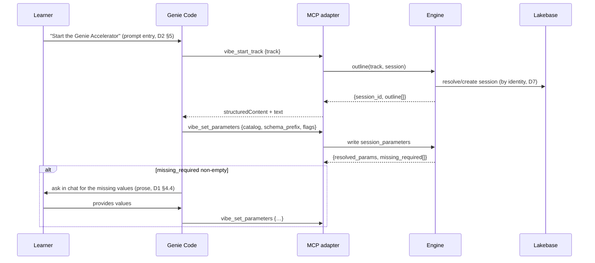
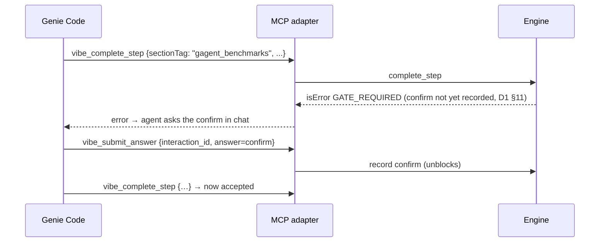

# D4 — Architecture & Sequence

**Status:** Draft · **Doc ID:** D4 · **Date:** 2026-09-22 · **Target repo:** `vibe-coding-workshop-app`
**Series:** [`README.md`](./README.md)
**Depends on:** [D3 domain](./workshop-engine-domain.md) · [D2 interface](./mcp-interface-contract.md)
· [D1 interactivity](./mcp-workshop-interactivity.md).
**Extends:** the roadmap architecture image
[`../images/mcp-workshop-engine-architecture.png`](../images/mcp-workshop-engine-architecture.png)
(source `.mmd`) — this doc supersedes its interactivity assumptions per the probe.
**Deployment constraints:** [`mcp-interactive-track-doc-plan.md` §1.3](./mcp-interactive-track-doc-plan.md#13-deployment-gotchas-proven-live-must-be-encoded-in-d4d7d9)
and [`designing-mcp-servers-for-genie-code.md` §4](./designing-mcp-servers-for-genie-code.md).

> **Scope.** The runtime shape: components, the Databricks Apps deployment topology (with the
> probe-proven gotchas encoded), and the sequence diagrams for the interactive walk. No new domain
> logic — this composes D1–D3.

---

## 0. Anchors verified live (2026-09-22)

| Fact | Location |
|---|---|
| FastAPI app construction | `app.py:34` |
| `security_middleware` (special-cases `/api/` only) | `app.py:60`, `/api/` gate `app.py:64` |
| `CORSMiddleware` / `ALLOWED_ORIGINS` | `app.py:106–109` / `app.py:44` |
| SPA catch-all — mount `/mcp` **before** this | `@app.get("/{full_path:path}")` `app.py:162` |
| Identity endpoint | `/api/user/current` `routes.py:6557` |
| Assembler (one path, both adapters) | `get_section_input_content` `routes.py:1241` |
| Sessions store | `db/lakebase/ddl/03_sessions.sql` |

---

## 1. Component architecture

```
        ┌────────── React SPA (browser) ──────────┐        ┌───── Genie Code (Agent mode, same workspace) ─────┐
        │  renders outline/step payloads; mirror   │        │  reads prompt verbatim; asks in-band; calls tools │
        └───────────────────┬──────────────────────┘        └──────────────────────┬────────────────────────────┘
                REST /api/track/*                                         MCP  POST /mcp  (Streamable HTTP, stateless)
                            │                                                        │
        ┌───────────────────▼───────────────────┐        ┌───────────────────────────▼──────────────────────────┐
        │        REST adapter (routes.py)        │        │            MCP adapter (mcp_server.py, FastMCP)        │
        │        thin: transport only            │        │  tools (D2) · resources · prompts · in-band layer (D1) │
        └───────────────────┬───────────────────┘        └───────────────────────────┬──────────────────────────┘
                            └──────────────┬───────────────────────────────────────────┘
                                           ▼
                    ┌──────────────── WORKSHOP ENGINE (src/backend/workshop/) ────────────────┐
                    │  manifest.py · engine.py (outline/next_step/can_start/complete_step)      │
                    │  assembler.py (extract of get_section_input_content — behavior-identical)  │
                    │  explainability payload (+ optional interaction block, D1 §6)             │
                    └───────────────────────────────────┬──────────────────────────────────────┘
                                                         ▼
                        Lakebase (sessions: completed_gates · captured_outputs · session_parameters
                                  · session_interactions)   ── mirrored by ──▶  .vibecoding-state.md (narrative ledger)
```

**Principle (roadmap):** one domain core, two thin transport adapters, one persisted state keyed by
`session_id`. Adapters contain **no** workshop logic. The **in-band interactivity layer** (D1) lives
in the MCP adapter as payload shaping + the `vibe_submit_answer` handler; the engine owns the
question/coaching content it surfaces (from D5's seeded bank).

> The `.png`/`.mmd` architecture image must be regenerated to add the interactivity layer and drop
> the elicitation arrow (roadmap kept in lockstep, per the file map).

---

## 2. Deployment topology (Databricks Apps) — gotchas encoded

Single Databricks App hosts **SPA + `/api` + `/mcp`**. The probe-proven requirements
(plan §1.3, generic §4) are **binding**:

1. **App name starts with `mcp-`** (generic §4.1) — else Genie Code won't offer it as an MCP server.
2. **Mount `/mcp` BEFORE the SPA catch-all** (`app.py:162`) and exclude `/mcp` in `serve_spa`, so it
   is not swallowed into `index.html`.
3. **Answer `POST /mcp` with 200, not 307** (generic §4.2). Genie Code POSTs to `/mcp` (no slash);
   the mounted app lives at `/mcp/`. Use an **ASGI path rewrite** (`/mcp` → `/mcp/`) so no redirect
   is emitted. Regression-tested in D8.
4. **Wire the MCP app's lifespan** into the parent FastAPI app (generic §4.3):
   `mcp_app = mcp.http_app(path="/", transport="streamable-http", stateless_http=True)`; the parent
   (`app.py:34`) must compose `mcp_app.lifespan` or FastMCP's session manager never starts.
5. **Stateless** — all durable state in Lakebase keyed by `session_id` (D6); no in-process
   correctness state.
6. **Auth proxy fronts everything** — unauthenticated requests get a 302 to OAuth; the app never
   sees them (D7). `clientInfo.name` is the connection name, not the user.

### 2.1 Mount sketch (illustrative)
```python
# app.py — order matters: MCP mount + rewrite BEFORE the SPA catch-all (:162)
from src.backend.mcp_server import mcp
mcp_app = mcp.http_app(path="/", transport="streamable-http", stateless_http=True)
# compose lifespan with the existing app's lifespan (see D7); then:
app.mount("/mcp", mcp_app)
app.add_middleware(McpPathRewrite)   # /mcp -> /mcp/  (no 307)
# serve_spa(...) must early-return / 404 for paths under /mcp
```

---

## 3. Sequence diagrams

### 3.1 Start track + in-band parameter capture



### 3.2 Step walk: comprehension check → execute → gate → complete

```mermaid
sequenceDiagram
  participant U as Learner
  participant GC as Genie Code
  participant MCP as MCP adapter
  participant E as Engine
  participant DB as Lakebase
  GC->>MCP: vibe_get_step {session_id}
  MCP->>E: explainability payload (+ interaction, D1 §6)
  E-->>MCP: {prompt(verbatim), why, how_to_apply, gate, next, interaction.pre?}
  MCP-->>GC: payload
  GC->>U: present prompt VERBATIM, then narrate why/how
  opt interaction.pre (comprehension, skippable)
    GC->>U: ask the question in chat
    U->>GC: answer (or silence → default)
    GC->>MCP: vibe_submit_answer {interaction_id, answer}
    MCP->>E: record answer; return coaching
    E->>DB: append session_interactions
  end
  GC->>U: EXECUTE step (write YAML / run SQL / build dashboard)
  opt interaction.decision (recommend-and-proceed, D1 §4.2)
    GC->>U: state recommended default; proceed unless corrected
    U-->>GC: (optional override)
    GC->>MCP: vibe_submit_answer {decision}
  end
  GC->>MCP: vibe_complete_step {sectionTag, captured_output}   %% gate = next-action-as-approval
  MCP->>E: complete_step(...)
  E->>DB: append completed_gates; write captured_outputs
  E-->>MCP: {completed_gates, next}
  MCP-->>GC: next step (or {done:true})
```

### 3.3 Cross-surface live sync

```mermaid
sequenceDiagram
  participant GC as Genie Code
  participant MCP as MCP adapter
  participant E as Engine
  participant DB as Lakebase
  participant UI as React SPA (facilitator)
  GC->>MCP: vibe_complete_step {sectionTag, captured_output}
  MCP->>E: complete_step
  E->>DB: completed_gates += sectionTag ; captured_outputs[produces]=text
  UI->>E: GET /api/track/{track}/outline?session_id  (poll/SSE, same session_id)
  E->>DB: read state
  E-->>UI: outline with step marked done → narrative advances
```

### 3.4 Step-9 hard-stop (`gagent_benchmarks`)



---

## 4. Request lifecycle & statelessness

Every MCP/REST request: **resolve identity → session_id (D7) → read session state fresh from
Lakebase → run pure engine function (D3) → persist deltas → return.** No engine correctness depends
on in-process state (roadmap "stateless MCP"). Two concurrent sessions never share memory (D7 §5).

---

## 5. Degradation paths (no dead-ends)

| Condition | Behavior |
|---|---|
| Client declares no elicitation (always, today) | In-band path (D1) — default, no code branch blocks |
| Missing upstream `consumes` output | Assembler placeholder (`routes.py:1351`); never raises (D3 §6) |
| `execution: ui-driven` step | Coached; `complete_step` records a handoff marker, not a false gate (D3 §5.4) |
| Malformed tool output | `isError` result (D2 §6/§7); never malformed `structuredContent` |
| `/mcp` reached without auth | 302 by the proxy before the app (D7) |

---

## 6. File & anchor map (from roadmap §12)

| File | Role | Phase |
|---|---|---|
| `src/backend/mcp_server.py` | FastMCP instance, tools/resources/prompts, in-band layer | 1 |
| `app.py` | mount `/mcp` before catch-all (`:162`); path-rewrite middleware; compose lifespan (`:34`); `serve_spa` excludes `/mcp` | 1 |
| `src/backend/workshop/*` | engine core (D3) | 0 |
| `../images/mcp-workshop-engine-architecture.{mmd,png}` | regenerate: add interactivity layer, drop elicitation arrow | 1 |

---

## 7. Open questions (defer to human)

1. **UI live-sync transport** — polling `/api/track/*` vs. SSE on `session_id`. Recommend polling
   for v1 (simpler, stateless-friendly); SSE later.
2. **Path rewrite vs. dual mount** — ASGI rewrite (recommended, proven in the probe) vs. mounting at
   both `/mcp` and `/mcp/`. Confirm the rewrite composes cleanly with the lifespan wiring.
3. **Lifespan composition** — the parent app already has a lifespan (`app.py:34`); confirm the
   compose pattern (contextlib `AsyncExitStack`) vs. re-order.
